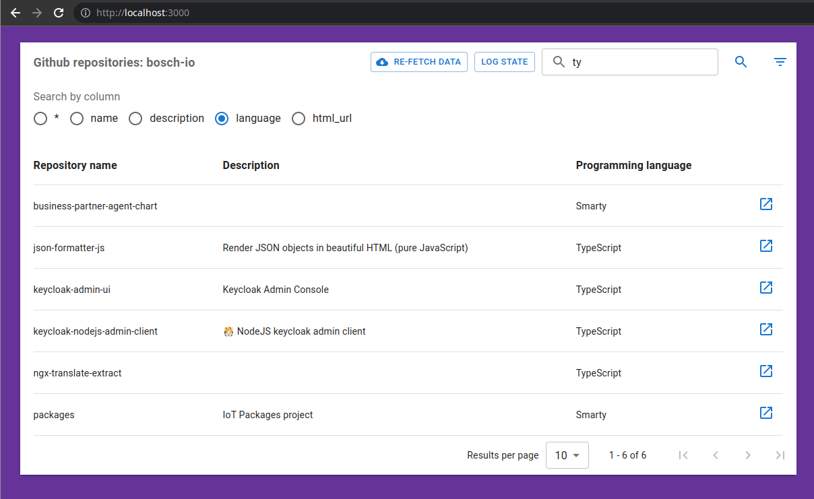

# React Datatable

## Usage (with docker-compose)

- Run app with `npm start`
  - This will execute `docker-compose up --build -d` in the background
- Use app at `http://localhost:3000`



## Without docker

For development purposes, it is also fine to go to the `client` folder and:

```
npm install
npm start
```

App will again be available at `http://localhost:3000`.
